### I try to build cool things.

<a href="https://player-two-site.vercel.app">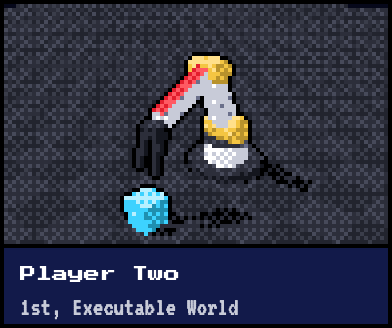</a>
<a href="https://pytorch.org/blog/building-the-future-of-on-device-ai-at-the-executorch-hackathon/">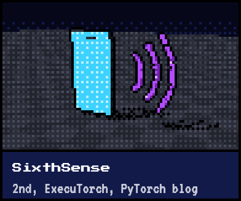</a>
<a href="https://foundry-biz-eight.vercel.app">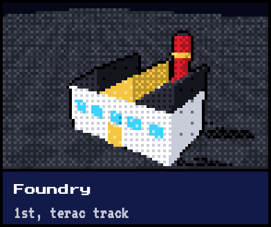</a>
<a href="https://healthflow-911.vercel.app">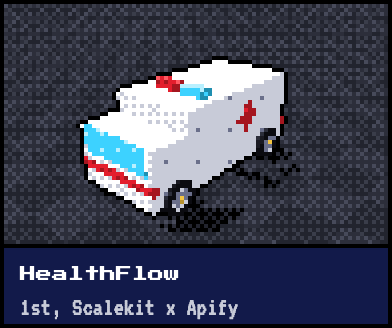</a>
 
<a href="https://github.com/PranavAchar01/Vigil-AnthropicxLightspeedxAbridge-Hackathon">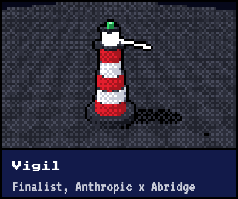</a>
<a href="https://optivia.dev">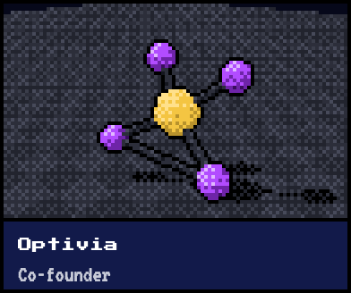</a>
<a href="https://github.com/PranavAchar01/error-propagation-llm-reasoning">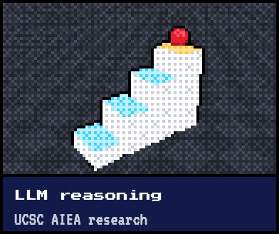</a>
<a href="https://github.com/search?q=author%3APranavAchar01+is%3Apr+is%3Amerged&type=pullrequests">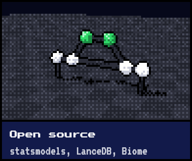</a>
 
<a href="https://github.com/PranavAchar01/guardianeye">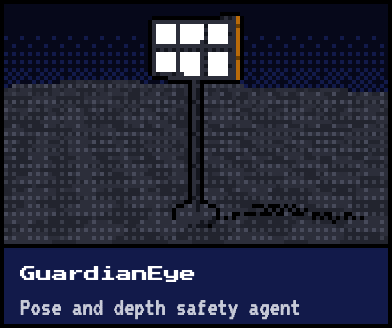</a>
<a href="https://github.com/PranavAchar01/osteon">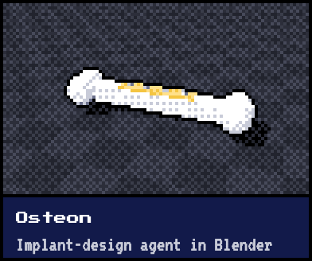</a>
<a href="https://github.com/PranavAchar01/scrutineer">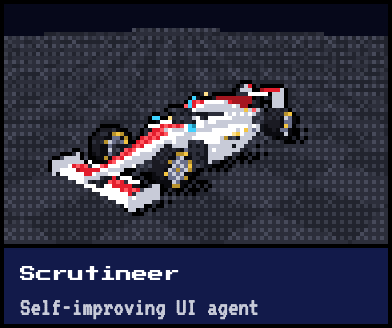</a>
<a href="https://sightline-nine.vercel.app">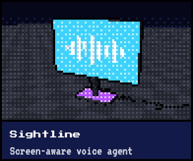</a>
 
<a href="https://github.com/PranavAchar01/lumen">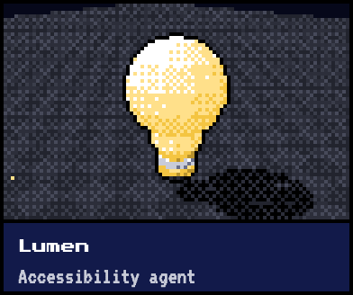</a>
<a href="https://github.com/PranavAchar01/PranavAchar01/blob/main/resume.pdf">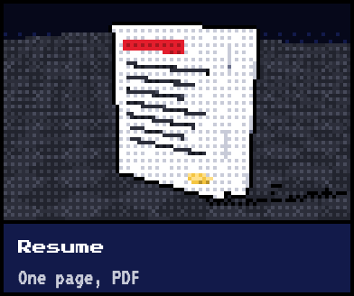</a>
<a href="https://pranavachar.vercel.app">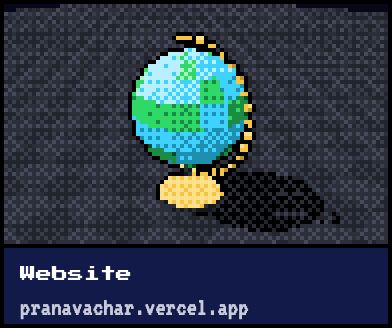</a>

